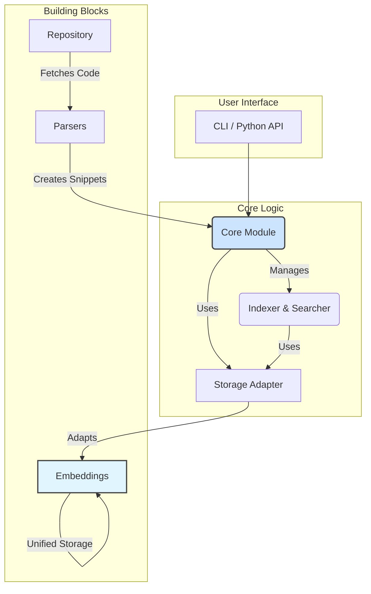

# CodeRepoIndex

<!-- <p align="center">
  
</p> -->

<p align="center">
  <strong>通过语义理解，释放代码仓库的全部潜力</strong>
</p>

<p align="center">
    <a href="https://codecov.io/gh/XingYu-Zhong/CodeRepoIndex">
        
    </a>
    <a href="https://pypi.org/project/coderepoindex/">
        
    </a>
    <a href="https://github.com/XingYu-Zhong/CodeRepoIndex/blob/main/LICENSE">
        
    </a>
</p>

**CodeRepoIndex** 是一个开源的本地化代码语义索引和搜索工具。它能够将完整的代码仓库转换为一个可被语义查询的本地索引，帮助开发者快速在大型代码库中定位相关的代码功能、实现和示例。

## 核心功能

- **🤖 智能代码解析**: 自动将代码文件分解为函数、类、方法等有意义的逻辑单元。
- **🧠 语义嵌入**: 使用先进的嵌入模型（如 OpenAI, 阿里云通义等）将代码块转换为高维向量。
- **💾 统一存储**: 基于embedding模块的统一存储架构，高效管理代码元数据和向量数据。
- **🔍 纯向量搜索**: 专注于语义向量搜索，支持中英文自然语言查询和代码片段查询。
- **⚙️ 灵活配置**: 支持环境变量、JSON配置文件、代码内直接传入等多种配置方式。
- **📦 开箱即用**: 提供简洁的 Python API 和命令行工具。

## 架构与模块设计

项目采用模块化设计，各组件职责清晰，易于扩展。下图展示了核心模块及其关系：



### 模块详解

想深入了解每个模块的设计和实现吗？请点击下面的链接查看详细文档：

- **[📄 `core` 模块](./docs/core_module.md)**: 项目的中央协调器，整合其他模块提供索引和搜索服务。
- **[📄 `embeddings` 模块](./docs/embeddings_module.md)**: 统一存储模块，负责将代码块转换为向量并管理存储。
- **[📄 `parsers` 模块](./docs/parsers_module.md)**: 代码解析核心，使用 `tree-sitter` 将源文件解析为结构化数据。
- **[📄 `repository` 模块](./docs/repository_module.md)**: 数据源获取层，负责从 Git 或本地目录获取代码。
- **[📄 `models` 模块](./docs/models_module.md)**: 对接外部AI模型（LLM 和 Embedding）的抽象层。
- **[📄 `cli` 模块](./docs/cli_module.md)**: 提供强大的命令行接口。

## 快速开始

### 1. 安装

```bash
# 从 PyPI 安装
pip install coderepoindex

# 或者从源码安装最新版本
git clone https://github.com/XingYu-Zhong/CodeRepoIndex.git
cd CodeRepoIndex
pip install -e .
```

### 2. 配置

CodeRepoIndex 提供了非常灵活的配置系统，支持分别配置 LLM 模型和 Embedding 模型的 API 密钥和基础 URL。您可以根据偏好选择其中一种配置方式。

**配置加载优先级**: `代码中直接传入的参数` > `环境变量` > `coderepoindex.json` > `默认值`。

#### 方式一：JSON 配置文件 (推荐)

在您的项目根目录下创建一个名为 `coderepoindex.json` 的文件。这是管理所有设置的最清晰的方式。CodeRepoIndex 会自动查找并加载此文件。

**`coderepoindex.json` 示例 (分离式配置):**
```json
{
  "project_name": "CodeRepoIndex",
  "log_level": "INFO",
  
  "llm": {
    "provider_type": "api",
    "model_name": "qwen-plus",
    "api_key": "your-llm-api-key",
    "base_url": "https://dashscope.aliyuncs.com/compatible-mode/v1",
    "timeout": 30.0,
    "extra_params": {
      "temperature": 0.7,
      "max_tokens": 2000
    }
  },
  
  "embedding": {
    "provider_type": "api",
    "model_name": "text-embedding-v3",
    "api_key": "your-embedding-api-key",
    "base_url": "https://dashscope.aliyuncs.com/compatible-mode/v1",
    "timeout": 30.0,
    "batch_size": 32
  },
  
  "storage": {
    "storage_backend": "local",
    "vector_backend": "chromadb",
    "base_path": "./my_code_index",
    "cache_enabled": true,
    "cache_size": 1000
  }
}
```

**兼容性配置 (统一 API):**
```json
{
  "api_key": "your-unified-api-key",
  "base_url": "https://dashscope.aliyuncs.com/compatible-mode/v1",
  "embedding_model": "text-embedding-v3",
  "storage_path": "./my_code_index",
  "vector_backend": "chromadb",
  "log_level": "INFO"
}
```

#### 方式二：环境变量

您也可以通过设置环境变量来配置，这在 CI/CD 或 Docker 环境中非常有用。

**分离式环境变量配置:**
```bash
# LLM 配置
export CODEREPO_LLM_API_KEY="your-llm-api-key"
export CODEREPO_LLM_BASE_URL="https://dashscope.aliyuncs.com/compatible-mode/v1"
export CODEREPO_LLM_MODEL="qwen-plus"

# Embedding 配置
export CODEREPO_EMBEDDING_API_KEY="your-embedding-api-key"
export CODEREPO_EMBEDDING_BASE_URL="https://dashscope.aliyuncs.com/compatible-mode/v1"
export CODEREPO_EMBEDDING_MODEL="text-embedding-v3"

# 存储配置
export CODEREPO_STORAGE_PATH="./my_code_index"
export CODEREPO_VECTOR_BACKEND="chromadb"
export CODEREPO_LOG_LEVEL="INFO"
```

**兼容性环境变量配置:**
```bash
# 统一 API 配置 (LLM 和 Embedding 使用相同的 API)
export CODEREPO_API_KEY="your-api-key"
export CODEREPO_BASE_URL="https://dashscope.aliyuncs.com/compatible-mode/v1"
export CODEREPO_STORAGE_PATH="./my_code_index"
```

#### 方式三：在代码中直接传入

在快速原型开发或测试时，可以直接在代码中定义配置。

**分离式配置:**
```python
from coderepoindex.config import load_config

config = load_config(
    llm_api_key="your-llm-key",
    llm_base_url="https://api.openai.com/v1",
    llm_model_name="gpt-4",
    
    embedding_api_key="your-embedding-key",
    embedding_base_url="https://api.cohere.ai/v1", 
    embedding_model_name="embed-english-v3.0",
    
    storage_base_path="./temp_index"
)
```

**兼容性配置:**
```python
from coderepoindex.config import load_config

config = load_config(
    api_key="your_api_key",
    base_url="https://your-api-provider.com/v1",
    storage_path="./temp_index"
)
```

> 更多高级配置选项和说明，请参考 [**配置文档 (`docs/configuration.md`)**](./docs/configuration.md)。

### 3. 使用示例

#### 示例 1: 完整的项目管理工作流

这个例子展示了最完整的使用场景，包括项目管理、索引、搜索等所有功能。

```python
import asyncio
from coderepoindex.config import load_config
from coderepoindex.core import CodeIndexer, CodeSearcher, create_project_manager
from coderepoindex.repository import create_git_config

async def main():
    # 1. 加载配置
    config = load_config(
        config_dict={
            "embedding": {
                "api_key": "your-api-key-here",
                "base_url": "https://dashscope.aliyuncs.com/compatible-mode/v1",
                "model_name": "text-embedding-v3",
                "provider_type": "api"
            },
            "storage": {
                "storage_backend": "local",
                "vector_backend": "memory",  # 或使用 "chroma" 进行持久化
                "base_path": ".storage"
            }
        }
    )

    print(f"🔧 配置加载完成")
    print(f"Embedding模型: {config.embedding.model_name}")
    print(f"存储路径: {config.storage.base_path}")

    # 2. 创建项目管理器
    print("\n🚀 初始化项目管理器...")
    project_manager = create_project_manager(config=config)
    
    with project_manager:
        # 3. 定义仓库信息
        repo_url = "https://github.com/XingYu-Zhong/testpythonproject"
        repo_config = create_git_config(repo_url=repo_url, branch="master")
        
        # 4. 创建或获取项目
        print(f"\n📁 管理项目: {repo_url}")
        try:
            project = project_manager.create_project(
                name="Test Python Project",
                description="用于测试的Python项目",
                repository_url=repo_url,
                project_id="testpythonproject"  # 使用固定ID方便复用
            )
            print(f"✅ 项目创建成功: {project.name}")
        except ValueError:
            # 项目已存在，获取现有项目
            project = project_manager.get_project("testpythonproject")
            print(f"📋 使用现有项目: {project.name}")
        
        # 5. 设置为当前项目
        project_manager.set_current_project(project.project_id)
        print(f"🎯 当前项目: {project.name}")
        
        # 6. 创建索引器和搜索器
        indexer = CodeIndexer(config=config)
        searcher = CodeSearcher(config=config)
        
        # 7. 索引仓库（使用项目ID确保数据一致性）
        print(f"\n🔍 开始索引项目...")
        index_result = indexer.index_repository(
            repo_config, 
            repository_id=project.project_id  # 关键：使用项目ID
        )
        
        print(f"✅ 索引完成!")
        print(f"  - 代码块数: {index_result['total_blocks']}")
        print(f"  - 处理文件数: {index_result.get('processed_files', 0)}")
        print(f"  - 语言分布: {index_result.get('language_distribution', {})}")
        
        # 8. 验证项目统计
        print(f"\n📊 项目统计:")
        stats = project_manager.get_project_stats(project.project_id)
        print(f"  - 代码块数: {stats.get('total_blocks', 0)}")
        print(f"  - 文件数: {stats.get('total_files', 0)}")
        print(f"  - 语言分布: {stats.get('language_distribution', {})}")
        
        # 9. 语义搜索示例
        print(f"\n🔎 语义搜索演示...")
        queries = [
            "How to send a POST request with JSON data?",
            "如何处理文件上传",
            "数据库连接池配置"
        ]
        
        for query in queries:
            print(f"\n🔍 查询: {query}")
            
            # 项目级搜索（自动限制在当前项目内）
            pm_results = project_manager.search_in_project(
                query=query, 
                top_k=2
            )
            
            if pm_results:
                print(f"  找到 {len(pm_results)} 个相关结果:")
                for i, result in enumerate(pm_results, 1):
                    print(f"    {i}. {result.block.file_path}:{result.block.line_start}")
                    print(f"       函数: {result.block.name}")
                    print(f"       相似度: {result.score:.4f}")
            else:
                print("  暂无搜索结果")
        
        # 10. 多项目管理演示
        all_projects = project_manager.list_projects()
        print(f"\n🌟 项目管理功能:")
        print(f"📋 系统中共有 {len(all_projects)} 个项目:")
        for i, proj in enumerate(all_projects, 1):
            current_marker = " (当前)" if proj.project_id == project.project_id else ""
            print(f"  {i}. {proj.name} ({proj.project_id[:12]}...){current_marker}")
            if proj.description:
                print(f"     描述: {proj.description}")

if __name__ == "__main__":
    asyncio.run(main())
```

#### 示例 2: 本地项目快速索引

针对本地开发的简化版本：

```python
from coderepoindex.config import load_config
from coderepoindex.core import CodeIndexer, CodeSearcher, create_project_manager
from coderepoindex.repository import create_local_config

# 快速配置（用于本地测试）
config = load_config(
    config_dict={
        "embedding": {
            "api_key": "your-api-key",
            "base_url": "https://api.provider.com/v1",
            "model_name": "text-embedding-model",
            "provider_type": "api"
        },
        "storage": {
            "storage_backend": "local",
            "vector_backend": "chroma",  # 使用ChromaDB持久化
            "base_path": "./my_project_index"
        }
    }
)

# 初始化
project_manager = create_project_manager(config=config)
indexer = CodeIndexer(config=config)
searcher = CodeSearcher(config=config)

with project_manager:
    # 创建本地项目
    repo_config = create_local_config(path="./my_local_project")
    
    project = project_manager.create_project(
        name="My Local Project",
        description="本地开发项目",
        local_path="./my_local_project",
        project_id="my_local_project"
    )
    
    # 索引本地代码
    index_result = indexer.index_repository(
        repo_config,
        repository_id=project.project_id
    )
    
    print(f"索引完成: {index_result['total_blocks']} 个代码块")
    
    # 搜索示例
    results = project_manager.search_in_project(
        query="错误处理",
        top_k=5
    )
    
    for result in results:
        print(f"找到: {result.file_path} - {result.name}")
```

#### 示例 3: 多项目对比搜索

展示如何在多个项目间进行搜索对比：

```python
from coderepoindex.core import create_project_manager, CodeSearcher

project_manager = create_project_manager()
searcher = CodeSearcher()

with project_manager:
    # 列出所有项目
    projects = project_manager.list_projects()
    print(f"发现 {len(projects)} 个项目")
    
    # 在多个项目中搜索相同的查询
    query = "数据库连接"
    
    for project in projects:
        print(f"\n🔍 搜索项目: {project.name}")
        
        # 项目内语义搜索
        results = project_manager.search_in_project(
            query=query,
            project_id=project.project_id,
            top_k=3
        )
        
        if results:
            for result in results:
                print(f"  - {result.file_path}: {result.name} (分数: {result.score})")
        else:
            print(f"  - 无相关结果")
        
        # 向量搜索对比
        vector_results = searcher.search(
            query=query,
            repository_id=project.project_id,
            top_k=2
        )
        
        print(f"  向量搜索结果: {len(vector_results)} 个")
```

#### 示例 4: 多样化语义搜索

展示向量语义搜索对不同类型查询的处理能力：

```python
# 不同类型的搜索查询示例
search_examples = [
    "How to send a POST request with JSON data?",  # 英文自然语言
    "如何处理文件上传",  # 中文自然语言
    "database connection pooling",  # 技术术语
    "异常处理和错误恢复",  # 概念查询
    "def upload_file",  # 代码模式
]

for query in search_examples:
    print(f"\n🔍 查询: {query}")
    
    # 纯向量语义搜索会自动：
    # 1. 将查询转换为向量
    # 2. 计算语义相似度
    # 3. 按相似度排序
    results = project_manager.search_in_project(query=query, top_k=3)
    
    for i, result in enumerate(results, 1):
        print(f"  {i}. {result.file_path}:{result.block.line_start}")
        print(f"     匹配原因: {result.match_reason}")
        print(f"     分数: {result.score}")
```

#### 配置最佳实践

**生产环境配置 (`coderepoindex.json`)**:
```json
{
  "project_name": "MyCompanyProject",
  "log_level": "INFO",
  
  "embedding": {
    "provider_type": "api",
    "model_name": "text-embedding-v3",
    "api_key": "${EMBEDDING_API_KEY}",
    "base_url": "https://dashscope.aliyuncs.com/compatible-mode/v1",
    "timeout": 30.0,
    "batch_size": 32
  },
  
  "storage": {
    "storage_backend": "local",
    "vector_backend": "chroma",
    "base_path": "./company_code_index",
    "cache_enabled": true,
    "cache_size": 1000
  }
}
```

**开发环境快速配置**:
```bash
# 设置环境变量
export CODEREPO_EMBEDDING_API_KEY="your-key"
export CODEREPO_EMBEDDING_BASE_URL="https://api.provider.com/v1"
export CODEREPO_STORAGE_PATH="./dev_index"

# 运行代码
python your_script.py
```

## 命令行工具

CodeRepoIndex 还提供了强大的命令行工具，方便快速操作。使用前请确保已通过环境变量或配置文件设置好 API 密钥等配置。

```bash
# 索引一个本地目录
coderepoindex index local /path/to/your/project

# 索引一个 Git 仓库
coderepoindex index git https://github.com/requests/requests.git

# 向量语义搜索
coderepoindex search "how to send a post request"

# 中文语义搜索
coderepoindex search "错误处理和异常捕获"

# 代码片段搜索
coderepoindex search "def upload_file(request):"

# 列出已索引的仓库
coderepoindex list

# 查看配置状态
coderepoindex config show
```

## 贡献指南

我们欢迎所有形式的贡献！无论是报告问题、贡献代码还是改进文档，都对我们非常有价值。请查看 [**CONTRIBUTING.md**](CONTRIBUTING.md) 了解详细信息。

## 许可证

本项目基于 [MIT License](LICENSE) 开源。
