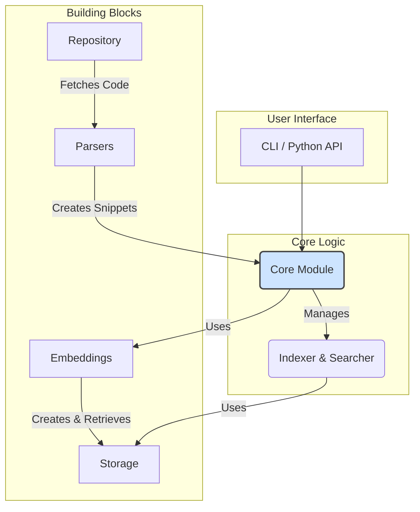

# CodeRepoIndex

<p align="center">
  
</p>

<p align="center">
  <strong>通过语义理解，释放代码仓库的全部潜力</strong>
</p>

<p align="center">
    <a href="https://github.com/XingYu-Zhong/CodeRepoIndex/actions/workflows/ci.yml">
        
    </a>
    <a href="https://codecov.io/gh/XingYu-Zhong/CodeRepoIndex">
        
    </a>
    <a href="https://pypi.org/project/coderepoindex/">
        
    </a>
    <a href="https://github.com/XingYu-Zhong/CodeRepoIndex/blob/main/LICENSE">
        
    </a>
    <a href="https://pepy.tech/project/coderepoindex">
        
    </a>
</p>

**CodeRepoIndex** 是一个开源的本地化代码语义索引和搜索工具。它能够将完整的代码仓库转换为一个可被语义查询的本地索引，帮助开发者快速在大型代码库中定位相关的代码功能、实现和示例。

## 核心功能

- **🤖 智能代码解析**: 自动将代码文件分解为函数、类、方法等有意义的逻辑单元。
- **🧠 语义嵌入**: 使用先进的嵌入模型（如 OpenAI, 阿里云通义等）将代码块转换为高维向量。
- **💾 本地化存储**: 将代码元数据（使用SQLite）和向量（支持ChromaDB, Faiss）高效地存储在本地。
- **🔍 强大搜索功能**: 支持自然语言、代码片段、元数据过滤和混合搜索。
- **⚙️ 灵活配置**: 支持环境变量、配置文件等多种配置方式。
- **📦 开箱即用**: 提供简洁的 Python API 和命令行工具。

## 架构与模块设计

项目采用模块化设计，各组件职责清晰，易于扩展。下图展示了核心模块及其关系：



### 模块详解

想深入了解每个模块的设计和实现吗？请点击下面的链接查看详细文档：

- **[📄 `core` 模块](./docs/core_module.md)**: 项目的中央协调器，整合其他模块提供索引和搜索服务。
- **[📄 `storage` 模块](./docs/storage_module.md)**: 持久化层，负责代码元数据和向量的存储与检索。
- **[📄 `embeddings` 模块](./docs/embeddings_module.md)**: 文本嵌入模块，负责将代码块转换为向量。
- **[📄 `parsers` 模块](./docs/parsers_module.md)**: 代码解析核心，使用 `tree-sitter` 将源文件解析为结构化数据。
- **[📄 `repository` 模块](./docs/repository_module.md)**: 数据源获取层，负责从 Git 或本地目录获取代码。
- **[📄 `models` 模块](./docs/models_module.md)**: 对接外部AI模型（LLM 和 Embedding）的抽象层。
- **[📄 `cli` 模块](./docs/cli_module.md)**: 提供强大的命令行接口。

## 快速开始

### 1. 安装

```bash
# 从 PyPI 安装
pip install coderepoindex

# 或者从源码安装最新版本
git clone https://github.com/XingYu-Zhong/CodeRepoIndex.git
cd CodeRepoIndex
pip install -e .
```

### 2. 配置

推荐使用环境变量来配置 API Key。在您的项目根目录创建一个 `.env` 文件：

```dotenv
# .env - 以阿里云通义千问为例
CODEREPO_API_KEY="your-dashscope-api-key"
CODEREPO_BASE_URL="https://dashscope-intl.aliyuncs.com/compatible-mode/v1"
```

> 更多配置方式（如使用OpenAI、设置存储路径等），请参考 [**配置文档**](./docs/configuration.md)。

### 3. 使用示例

下面的示例展示了如何索引一个本地代码仓库并对其进行搜索。

```python
import os
from coderepoindex import (
    load_config, 
    CodeIndexer, 
    CodeSearcher, 
    create_local_config
)

# 1. 加载配置 (自动从 .env 文件或环境变量读取)
try:
    config = load_config()
except ValueError as e:
    print(f"配置错误: {e}")
    exit(1)

# 2. 初始化索引器和搜索器
indexer = CodeIndexer(config=config)
searcher = CodeSearcher(config=config)

# 3. 定义要索引的本地仓库
repo_config = create_local_config(path=".") # 索引当前目录

# 4. 索引仓库 (如果索引已存在，会自动跳过)
print(f"开始索引本地仓库: {repo_config.path}")
stats = indexer.index_repository(repo_config)
repo_id = stats.get("repository_id")
print(f"索引完成，仓库ID: {repo_id}")

# 5. 执行搜索
query = "如何实现一个基于文件的本地存储后端？"
print(f"\n[查询]: {query}")

results = searcher.search(query=query, top_k=2, repository_id=repo_id)

for i, result in enumerate(results, 1):
    print(f"\n  结果 {i}: (相似度: {result.similarity_score:.4f})")
    print(f"  文件: {result.code_block.file_path}")
    print(f"  代码块 ({result.code_block.block_type.value}): {result.code_block.name}")
    print("  ---")
```

## 命令行工具

CodeRepoIndex 还提供了强大的命令行工具，方便快速操作。

```bash
# 索引一个 Git 仓库
coderepoindex index git https://github.com/requests/requests.git

# 在索引中搜索
coderepoindex search "how to send a post request"

# 列出已索引的仓库
coderepoindex list
```

## 贡献指南

我们欢迎所有形式的贡献！无论是报告问题、贡献代码还是改进文档，都对我们非常有价值。请查看 [**CONTRIBUTING.md**](CONTRIBUTING.md) 了解详细信息。

## 许可证

本项目基于 [MIT License](LICENSE) 开源。
