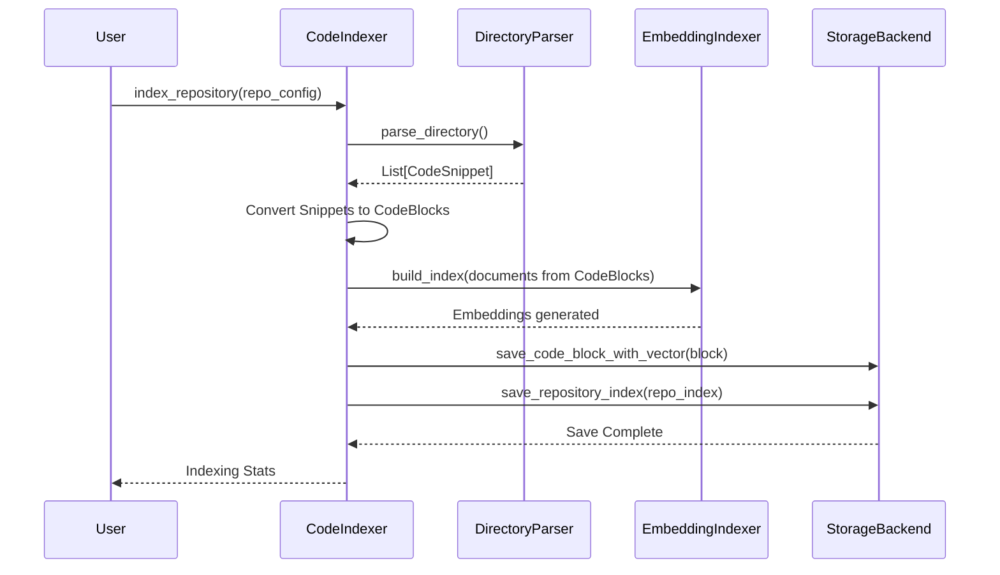
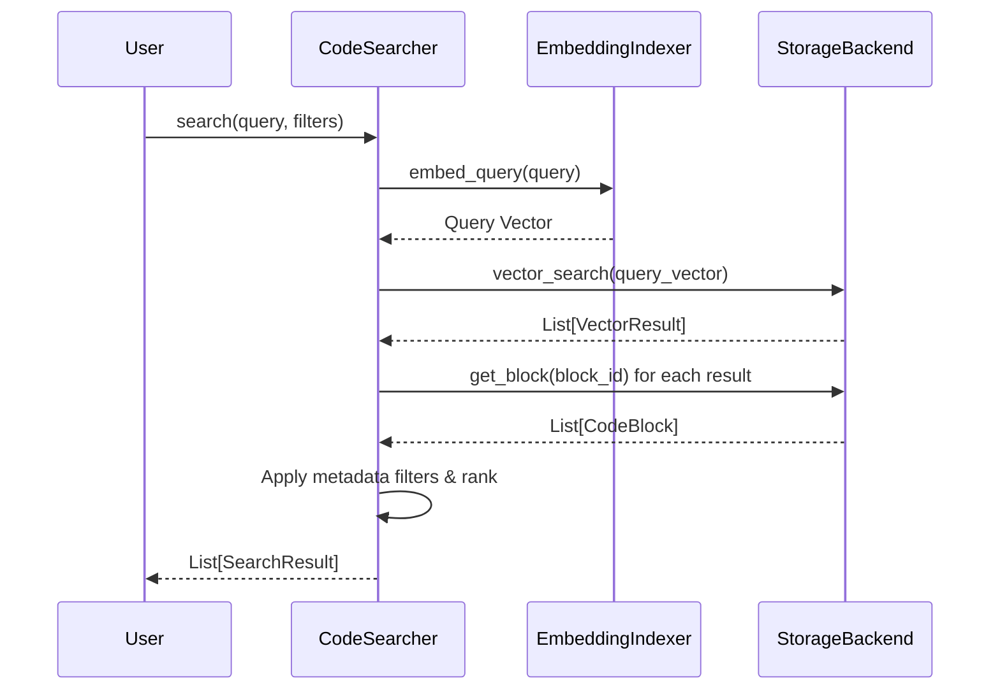

# Core 模块 (`coderepoindex.core`)

## 1. 概述

`core` 模块是 `CodeRepoIndex` 项目的中央协调器和业务逻辑核心。它整合了下层的 `repository`, `parsers`, `embeddings`, 和 `storage` 模块，提供了一个统一的高层接口，用于执行代码仓库的索引和搜索两大核心功能。

该模块主要由以下三个部分组成：
- **`models.py`**: 定义了系统的核心数据结构，如 `CodeBlock`, `RepositoryIndex`, `SearchResult` 等。
- **`indexer.py`**: 实现了 `CodeIndexer` 类，负责端到端的代码仓库索引流程。
- **`searcher.py`**: 实现了 `CodeSearcher` 类，负责在已建立的索引上执行复杂的语义和元数据搜索。

## 2. 核心组件

### 2.1. 数据模型 (`models.py`)

此文件定义了贯穿整个系统的标准数据对象，确保了不同模块间数据交换的一致性。

- **`CodeBlock`**: 这是系统中代码信息的基本原子单元。它不仅包含从 `parsers` 模块获取的代码片段内容、位置、类型、签名等信息，还包含了由 `embeddings` 模块生成的向量嵌入（`embedding`），以及唯一的 `block_id`。它是存储和检索的最终对象。
- **`RepositoryIndex`**: 记录了一个被索引的代码仓库的元数据信息，包括仓库URL、本地路径、分支、最后一次索引时间以及语言分布等统计信息。
- **`SearchQuery`**: 封装了一次搜索请求的所有参数，包括查询文本、`top_k`、相似度阈值以及各种过滤条件（如仓库ID、语言、文件路径等）。
- **`SearchResult`**: 封装了单条搜索结果，包含匹配到的 `CodeBlock`、相似度分数（`score`）以及匹配原因（`match_reason`）。

### 2.2. 索引器 (`indexer.py`)

- **`CodeIndexer` 类**: 这是一个高层封装，负责将一个完整的代码仓库处理成可搜索的索引。
    - **职责**:
        1.  **获取仓库**: (可选) 使用 `RepositoryFetcher` 克隆或拉取最新的代码仓库。
        2.  **解析代码**: 使用 `DirectoryParser` 遍历代码文件，再由 `CodeParser` 将文件内容解析成 `CodeSnippet`。
        3.  **数据转换**: 将 `CodeSnippet` 转换为标准的 `CodeBlock` 数据模型。
        4.  **生成嵌入**: 调用 `EmbeddingIndexer`，将 `CodeBlock` 的内容（如代码、名称、签名）转换为向量嵌入。
        5.  **持久化存储**: 将 `CodeBlock` 的元数据和其对应的向量嵌入分别存入由 `storage` 模块管理的存储后端（如本地JSON或数据库）和向量存储后端（如ChromaDB）。
        6.  **记录索引元数据**: 创建或更新 `RepositoryIndex` 对象，记录本次索引的统计信息。
    - **关键方法**:
        - `index_repository(repo_config)`: 对整个仓库执行完整的索引流程。
        - `index_file(file_path, ...)`: 对单个文件进行索引。
        - `delete_repository_index(repository_id)`: 删除一个仓库的所有相关索引数据。

### 2.3. 搜索器 (`searcher.py`)

- **`CodeSearcher` 类**: 提供了在已创建的索引上进行搜索的各种方法。
    - **职责**:
        1.  **接收查询**: 接收用户的自然语言查询或代码片段。
        2.  **生成查询向量**: 调用 `EmbeddingIndexer` (或其内部的 `EmbeddingProvider`) 将查询文本转换为向量。
        3.  **向量搜索**: 在 `storage` 模块的向量后端中执行相似性搜索，找出最相似的 `CodeBlock` 的ID。
        4.  **获取完整数据**: 根据ID从存储后端获取完整的 `CodeBlock` 对象。
        5.  **过滤与排序**: 应用用户指定的元数据过滤器（如语言、文件路径等），并根据相似度分数对结果进行排序。
        6.  **封装结果**: 将最终结果封装成 `SearchResult` 对象列表返回。
    - **关键方法**:
        - `search(query, ...)`: 最核心的搜索方法，支持丰富的过滤条件。
        - `search_by_code(code_snippet, ...)`: 专门用于代码对代码的搜索。
        - `search_by_metadata(metadata_filters, ...)`: 完全基于元数据进行精确查找，不涉及向量相似度。
        - `get_recommendations(file_path, ...)`: 基于一个文件的内容，推荐其他相关或相似的代码。

## 3. 工作流程

### 索引流程

### 搜索流程

