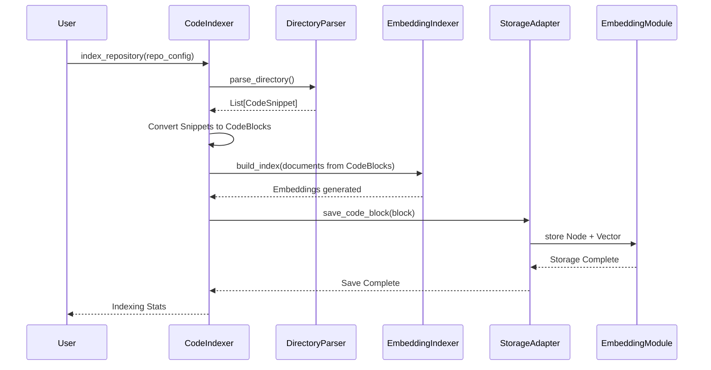
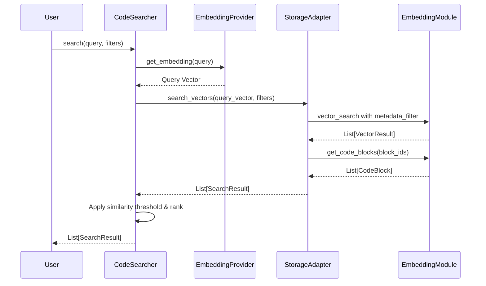

# Core 模块 (`coderepoindex.core`)

## 1. 概述

`core` 模块是 `CodeRepoIndex` 项目的中央协调器和业务逻辑核心。它整合了下层的 `repository`, `parsers`, 和 `embeddings` 模块，通过统一的存储适配器提供高层接口，用于执行代码仓库的索引和搜索两大核心功能。

该模块主要由以下四个部分组成：
- **`models.py`**: 定义了系统的核心数据结构，如 `CodeBlock`, `RepositoryIndex`, `SearchResult` 等。
- **`indexer.py`**: 实现了 `CodeIndexer` 类，负责端到端的代码仓库索引流程。
- **`searcher.py`**: 实现了 `CodeSearcher` 类，专注于纯向量语义搜索功能。
- **`storage_adapter.py`**: 提供存储适配器，将embedding模块包装为统一的存储接口。

## 2. 核心组件

### 2.1. 数据模型 (`models.py`)

此文件定义了贯穿整个系统的标准数据对象，确保了不同模块间数据交换的一致性。

- **`CodeBlock`**: 这是系统中代码信息的基本原子单元。它不仅包含从 `parsers` 模块获取的代码片段内容、位置、类型、签名等信息，还包含了由 `embeddings` 模块生成的向量嵌入（`embedding`），以及唯一的 `block_id`。它是存储和检索的最终对象。
- **`RepositoryIndex`**: 记录了一个被索引的代码仓库的元数据信息，包括仓库URL、本地路径、分支、最后一次索引时间以及语言分布等统计信息。
- **`SearchQuery`**: 封装了一次搜索请求的所有参数，包括查询文本、`top_k`、相似度阈值以及各种过滤条件（如仓库ID、语言、文件路径等）。
- **`SearchResult`**: 封装了单条搜索结果，包含匹配到的 `CodeBlock`、相似度分数（`score`）以及匹配原因（`match_reason`）。

### 2.2. 索引器 (`indexer.py`)

- **`CodeIndexer` 类**: 这是一个高层封装，负责将一个完整的代码仓库处理成可搜索的索引。
    - **职责**:
        1.  **获取仓库**: (可选) 使用 `RepositoryFetcher` 克隆或拉取最新的代码仓库。
        2.  **解析代码**: 使用 `DirectoryParser` 遍历代码文件，再由 `CodeParser` 将文件内容解析成 `CodeSnippet`。
        3.  **数据转换**: 将 `CodeSnippet` 转换为标准的 `CodeBlock` 数据模型。
        4.  **生成嵌入**: 调用 `EmbeddingIndexer`，将 `CodeBlock` 的内容（如代码、名称、签名）转换为向量嵌入。
        5.  **持久化存储**: 通过 `EmbeddingStorageAdapter` 将 `CodeBlock` 的元数据和其对应的向量嵌入存储到embedding模块管理的存储后端。
        6.  **记录索引元数据**: 创建或更新 `RepositoryIndex` 对象，记录本次索引的统计信息。
    - **关键方法**:
        - `index_repository(repo_config)`: 对整个仓库执行完整的索引流程。
        - `index_file(file_path, ...)`: 对单个文件进行索引。
        - `delete_repository_index(repository_id)`: 删除一个仓库的所有相关索引数据。

### 2.3. 搜索器 (`searcher.py`)

- **`CodeSearcher` 类**: 专注于纯向量语义搜索，提供自然语言查询和代码片段查询功能。
    - **核心特性**:
        1. **纯向量搜索**: 只使用语义向量相似度进行搜索，不依赖关键词匹配。
        2. **自然语言支持**: 支持中英文自然语言查询，如"如何处理文件上传"。
        3. **代码片段查询**: 可以使用代码片段作为查询，找到语义相似的代码。
        4. **智能过滤**: 支持按仓库、语言、文件路径、代码块类型等条件过滤。
        5. **相似度阈值**: 可设置最低相似度阈值，控制结果质量。
    - **职责**:
        1.  **接收查询**: 接收用户的自然语言查询或代码片段。
        2.  **生成查询向量**: 调用 `EmbeddingProvider` 将查询文本转换为向量。
        3.  **向量搜索**: 在embedding模块的向量存储中执行相似性搜索，找出最相似的代码块。
        4.  **应用过滤**: 应用用户指定的元数据过滤器（如语言、文件路径等）。
        5.  **结果排序**: 根据相似度分数对结果进行排序和阈值过滤。
        6.  **封装结果**: 将最终结果封装成 `SearchResult` 对象列表返回。
    - **核心方法**:
        - `search(query, top_k, **filters)`: 唯一的搜索入口点，支持自然语言和代码查询，以及丰富的过滤条件。
        - `connect()` / `disconnect()`: 连接管理方法。
        - 上下文管理器支持: 可使用 `with` 语句自动管理连接。

### 2.4. 存储适配器 (`storage_adapter.py`)

- **`EmbeddingStorageAdapter` 类**: 将embedding模块包装为统一的存储接口，提供与原storage模块兼容的API。
    - **职责**:
        1. **接口适配**: 将embedding模块的存储接口适配为core模块期望的接口
        2. **数据转换**: 处理 `CodeBlock` 和 `Node` 之间的数据结构转换
        3. **仓库管理**: 支持多仓库索引和搜索历史管理
        4. **向量存储**: 统一管理代码块的向量嵌入和元数据
    - **核心方法**:
        - `save_code_block()`: 保存代码块和向量
        - `query_code_blocks()`: 查询代码块
        - `search_vectors()`: 向量相似性搜索
        - `delete_repository_data()`: 删除仓库数据

## 3. 工作流程

### 索引流程



### 搜索流程



## 4. 使用示例

### 基础搜索

```python
from coderepoindex.core import CodeSearcher
from coderepoindex.config import load_config

# 创建搜索器
config = load_config()
searcher = CodeSearcher(config=config)

# 向量语义搜索
with searcher:
    # 自然语言查询
    results = searcher.search(
        query="如何处理文件上传",
        top_k=5,
        language="python",
        similarity_threshold=0.3
    )
    
    # 代码片段查询
    results = searcher.search(
        query="def upload_file(request):",
        top_k=3,
        repository_id="my_repo"
    )
```

### 高级过滤

```python
# 多条件过滤搜索
results = searcher.search(
    query="数据库连接池",
    top_k=10,
    repository_id="backend_repo",
    language="python", 
    block_type=BlockType.FUNCTION,
    file_path="*/models/*.py",
    similarity_threshold=0.4
)

for result in results:
    print(f"文件: {result.block.file_path}")
    print(f"函数: {result.block.name}")
    print(f"相似度: {result.score:.4f}")
    print(f"匹配原因: {result.match_reason}")
```
