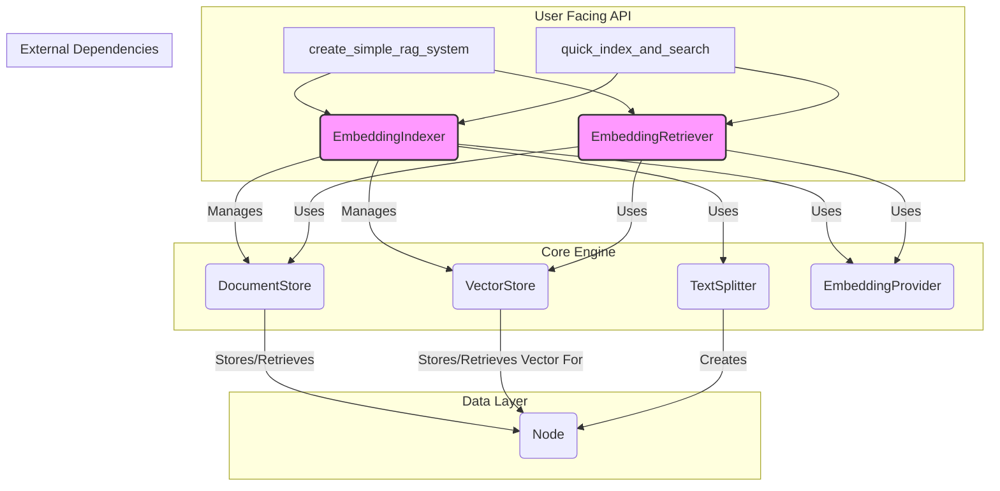

# Embedding 模块详细设计文档

## 1. 概述

`coderepoindex.embeddings` 模块是一个功能完备、设计精良的本地化检索增强生成（RAG）框架。它将一个典型的RAG系统所需的核心组件进行了清晰的抽象和实现，包括数据结构、存储、索引和检索。该模块旨在提供一个与 LlamaIndex 类似但更轻量、更易于本地部署的解决方案。

### 1.1. 设计理念

- **接口与实现分离**: 通过抽象基类（`Base*`）定义核心组件（如`DocumentStore`, `VectorStore`）的接口，使得具体的实现（如`Simple*`）可以被替换和扩展。
- **模块化与组合**: 各组件（存储、切分器、索引器、检索器）职责单一，可以像乐高积木一样灵活组合，以满足不同需求。
- **持久化支持**: 核心的文档存储和向量存储都支持基于JSON的本地文件持久化，方便索引的保存和重用。
- **易用性封装**: 提供高级工厂函数（`create_*`）和便捷的工具函数（`create_simple_rag_system`, `quick_index_and_search`），大大简化了用户的上手难度。
- **丰富的检索功能**: 除了基础的向量检索，还内置了强大的元数据检索、混合检索和上下文检索功能。

### 1.2. 核心组件关系图



## 2. 模块文件详解

### 2.1. `__init__.py` - 模块门面

这是模块的统一入口，它将所有核心组件和便捷函数导入到顶层命名空间，并提供了多个高级封装函数，是用户与模块交互的主要接口。

#### 主要函数

- **`create_simple_rag_system(...)`**: **推荐用法**。一键创建并返回一个配置好且**存储共享**的 `indexer` 和 `retriever` 实例。这是启动一个标准RAG应用最快的方式。
  ```python
  indexer, retriever = create_simple_rag_system(
      embedding_provider=provider,
      persist_dir="./my_rag_index"
  )
  ```
- **`quick_index_and_search(...)`**: 用于一次性的、无状态的内存搜索。它内部创建临时的、不持久化的 `indexer` 和 `retriever` 来完成任务。
- **元数据检索快捷函数**: 如 `search_by_metadata`, `search_by_id` 等，是对 `Retriever` 相应方法的直接封装，简化了调用。
- **同步管理函数**: `sync_indexer_retriever` 和 `check_sync_status` 用于管理和检查 `indexer` 和 `retriever` 之间存储实例的一致性。

### 2.2. `base.py` - 基础接口

该文件定义了所有核心组件的抽象基类（ABC），使用 `abc.abstractmethod` 强制子类实现关键方法，确保了整个系统的可扩展性和一致性。

- `BaseDocumentStore`: 定义文档节点（`Node`）增、删、查、改及持久化的接口。
- `BaseVectorStore`: 定义向量增、删、查（相似性搜索）及持久化的接口。
- `BaseIndexer`: 定义构建索引的接口 (`build_index`, `add_document`)。
- `BaseRetriever`: 定义信息检索的接口 (`retrieve`, `retrieve_with_scores`)。
- `BaseSplitter`: 定义文本切分器的接口 (`split_text`, `split_documents`)。

### 2.3. `node.py` - 数据结构

这是整个系统的基石，定义了信息的基本表示形式。

- **`Node` 类**: RAG处理的原子单元。
  - **核心属性**: 
    - `node_id`: 全局唯一ID (UUID)。
    - `text`: 文本片段。
    - `metadata`: 存储任意信息的字典，如来源、日期、文件路径等。
    - `relationships`: 定义与其他`Node`的关系（如`parent`, `next`），为上下文检索提供基础。
    - `embedding`: 存储该`Node`文本对应的向量。
  - **关键方法**: `to_dict()`, `from_dict()` 支持序列化；`get_content()` 可根据模式决定是否将元数据并入文本。

- **`Document` 类**: `Node`的子类，代表一份完整的原始文档。它自动将自己的ID存入元数据的`doc_id`字段，为后续的文档级操作（如删除、更新整个文档）提供依据。

### 2.4. `document_store.py` - 文档存储

- **`SimpleDocumentStore` 类**:
  - **实现**: 基于内存中的字典（`{node_id: Node}`）进行存储。
  - **持久化**: 可将整个字典序列化为 `document_store.json` 文件。
  - **核心功能**:
    - 高效的节点增、删、改、查。
    - **强大的元数据查询**: 提供了丰富的元数据搜索方法，如 `search_by_metadata`, `search_metadata_contains`, `search_metadata_range` 等。
    - **统计功能**: `get_statistics()` 和 `get_metadata_statistics()` 为数据分析和监控提供了便利。

### 2.5. `vector_store.py` - 向量存储

- **`SimpleVectorStore` 类**:
  - **实现**: 基于内存中的两个字典（`{node_id: embedding}` 和 `{node_id: metadata}`）进行存储。
  - **持久化**: 可将这两个字典序列化为 `vector_store.json` 文件。
  - **核心功能**:
    - **相似性搜索**: `query()` 方法通过计算查询向量与存储中所有向量的余弦相似度，实现（暴力的）相似性搜索。支持在搜索时进行元数据过滤。
    - **批量操作**: `add_batch()`, `delete_batch()` 提高了效率。
    - **阈值搜索**: `similarity_search_with_threshold()` 可返回所有相似度高于特定阈值的结果。

### 2.6. `indexer.py` - 索引构建器

- **`EmbeddingIndexer` 类**:
  - **职责**: 驱动端到端的索引构建流程。
  - **工作流**:
    1.  接收原始文档（`list[dict]`）。
    2.  使用 `TextSplitter` 将文档切分为 `Node` 列表。
    3.  调用 `EmbeddingProvider`，分批（`embed_batch_size`）为每个 `Node` 生成向量嵌入。
    4.  将生成的 `Node` 存入 `DocumentStore`。
    5.  将 `Node` 的ID和向量存入 `VectorStore`。
    6.  （可选）调用 `persist()` 方法将两个存储持久化到磁盘。
  - **关键特性**: 支持文档的增量添加 (`add_document`)、更新 (`update_document`) 和删除 (`delete_document`)。

### 2.7. `retriever.py` - 信息检索器

- **`EmbeddingRetriever` 类**:
  - **职责**: 根据用户查询从索引中检索最相关的信息。
  - **工作流**:
    1.  接收查询字符串（`query`）。
    2.  调用 `EmbeddingProvider` 将查询字符串转换为查询向量。
    3.  使用查询向量在 `VectorStore` 中执行相似性搜索，获得`top_k`个最相似的`Node` ID和分数。
    4.  使用这些 `Node` ID 从 `DocumentStore` 中获取完整的 `Node` 对象。
    5.  组合信息，返回包含文本、元数据和分数的详细结果列表。
  - **高级检索功能**:
    - `retrieve_by_metadata`: 完全基于元数据进行过滤式检索。
    - `retrieve_hybrid`: 实现混合搜索，结合了向量相似度分数和元数据匹配情况，动态计算一个“混合分”，排序更智能。
    - `retrieve_similar_to_node`: 找到与给定节点最相似的其他节点。
    - `retrieve_with_context`: 在返回检索结果的同时，自动抓取其上下文（前后`Node`），对于需要连贯信息的场景非常有用。

### 2.8. `utils.py` - 工具集

提供了文本切分和向量计算的工具。

- **`SimpleTextSplitter` 类**: 基于字符数进行切分，支持设置块大小（`chunk_size`）和重叠（`chunk_overlap`）。
- **`SentenceSplitter` 类**: 尝试在句子边界进行切分，使得文本块在语义上更加完整。
- **向量工具函数**: `cosine_similarity`, `batch_cosine_similarity`, `normalize_vector` 等。

## 3. 使用示例

### 3.1. 完整流程：从索引到检索

```python
import os
from coderepoindex.embeddings import create_simple_rag_system
from coderepoindex.models import create_openai_providers

# 1. 配置环境和模型
# 确保设置了 API Key 和 Base URL
# os.environ["OPENAI_API_KEY"] = "your-api-key"
# os.environ["OPENAI_BASE_URL"] = "your-base-url"

try:
    provider = create_openai_providers(
        api_key="sk-test-key",
        base_url="https://dashscope-intl.aliyuncs.com/compatible-mode/v1",
        embedding_model="text-embedding-v3"
    )
    embedding_provider = provider.embedding_provider
except Exception as e:
    print(f"无法创建嵌入提供商: {e}")
    exit()

# 2. 创建 RAG 系统
# 这会同时创建 indexer 和 retriever，并共享底层的存储
indexer, retriever = create_simple_rag_system(
    embedding_provider=embedding_provider,
    persist_dir="./my_index",
    chunk_size=500,
    chunk_overlap=100
)

# 3. 准备文档并构建索引
documents = [
    {
        "text": "人工智能（AI）是计算机科学的一个分支，致力于创建能够执行通常需要人类智能的任务的系统。",
        "metadata": {"source": "AI_intro", "topic": "AI"}
    },
    {
        "text": "机器学习是人工智能的一个子领域，专注于开发能够从数据中学习并做出预测或决策的算法。",
        "metadata": {"source": "ML_basics", "topic": "ML"}
    },
]

print("正在构建索引...")
# clear_existing=True 会在构建前清空旧索引
indexer.build_index(documents, clear_existing=True)
print("索引构建完成并已持久化到 ./my_index")

# 4. 执行检索
query = "什么是机器学习？"
print(f"\n正在执行查询: {query}")

results = retriever.retrieve(query, top_k=1)

# 5. 查看结果
for result in results:
    print(f"  - Score: {result['score']:.4f}")
    print(f"  - Text: {result['text']}")
    print(f"  - Metadata: {result['metadata']}")

```

## 4. 本地化存储实现详解

本模块的本地化存储功能是其轻量级和易于部署特性的核心。它不依赖任何外部数据库，而是通过将内存中的数据对象序列化为本地JSON文件来实现持久化。整个过程由 `EmbeddingIndexer` 协调，并由 `SimpleDocumentStore` 和 `SimpleVectorStore` 具体执行。

### 4.1. 核心机制

- **持久化目录 (`persist_dir`)**: 当创建 `EmbeddingIndexer` 或 `EmbeddingRetriever` 时，可以指定一个 `persist_dir` 路径。所有相关的持久化文件都将存储在该目录下。
- **数据文件**:
  - `document_store.json`: 存储所有 `Node` 对象的完整信息（文本、元数据、关系等）。
  - `vector_store.json`: 存储所有节点的向量嵌入（Embeddings）和与之关联的元数据。

### 4.2. `SimpleDocumentStore` 的持久化

该类负责存储 `Node` 对象本身。

- **内存存储**: `self._nodes: Dict[str, Node]`，一个以 `node_id` 为键，`Node` 对象为值的字典。

- **`persist(filepath)` 方法**:
  1.  接收一个文件路径（例如 `./my_index/document_store.json`）。
  2.  创建一个顶层字典 `data`。
  3.  遍历内存中的 `self._nodes` 字典。对于每一个 `Node` 对象，调用其 `node.to_dict()` 方法，将其转换为一个可序列化的字典。
  4.  将转换后的节点字典存储在 `data['nodes']` 下。
  5.  添加一些元数据，如版本号和节点总数。
  6.  使用 `json.dump()` 将整个 `data` 字典写入指定的 `filepath`。

  **`document_store.json` 文件结构示例**:
  ```json
  {
    "nodes": {
      "node_id_1": {
        "node_id": "node_id_1",
        "text": "这是第一个文本块...",
        "metadata": {"source": "doc1", "chunk_index": 0},
        "relationships": {"next": "node_id_2"},
        "embedding": null
      },
      "node_id_2": { ... }
    },
    "metadata": {
      "total_nodes": 2,
      "version": "1.0"
    }
  }
  ```

- **`load_from_path(filepath)` 方法**:
  1.  使用 `json.load()` 读取并解析指定的JSON文件。
  2.  清空内存中的 `self._nodes` 字典。
  3.  遍历JSON数据中 `nodes` 字典里的每一个节点数据。
  4.  对每个节点数据调用 `Node.from_dict()` 类方法，将字典重新构造成一个 `Node` 对象。
  5.  将重建的 `Node` 对象存入内存的 `self._nodes` 字典中。

### 4.3. `SimpleVectorStore` 的持久化

该类负责存储与 `Node` 对应的向量和部分元数据。

- **内存存储**:
  - `self._embeddings: Dict[str, List[float]]`，存储 `node_id` 到其向量的映射。
  - `self._metadata: Dict[str, Dict[str, Any]]`，存储 `node_id` 到其元数据的映射。

- **`persist(filepath)` 方法**:
  1.  接收一个文件路径（例如 `./my_index/vector_store.json`）。
  2.  创建一个顶层字典 `data`。
  3.  直接将内存中的 `self._embeddings` 和 `self._metadata` 两个字典赋值给 `data['embeddings']` 和 `data['metadata']`。
  4.  添加一些关于向量存储的信息，如向量总数和维度。
  5.  使用 `json.dump()` 将整个 `data` 字典写入文件。

  **`vector_store.json` 文件结构示例**:
  ```json
  {
    "embeddings": {
      "node_id_1": [0.1, 0.2, ..., -0.05],
      "node_id_2": [-0.2, 0.03, ..., 0.12]
    },
    "metadata": {
      "node_id_1": {"doc_id": "doc_id_abc"},
      "node_id_2": {"doc_id": "doc_id_abc"}
    },
    "info": {
      "total_vectors": 2,
      "dimension": 768,
      "version": "1.0"
    }
  }
  ```

- **`load_from_path(filepath)` 方法**:
  1.  读取并解析JSON文件。
  2.  清空内存中的 `self._embeddings` 和 `self._metadata`。
  3.  直接将JSON数据中的 `embeddings` 和 `metadata` 字典加载到内存对应的字典中。

### 4.4. 整体协调

`EmbeddingIndexer` 和 `EmbeddingRetriever` 是这一切的协调者。

- **初始化时**: 当你用 `persist_dir` 初始化它们时，它们会自动创建 `SimpleDocumentStore` 和 `SimpleVectorStore` 实例，并向其构造函数传递正确的持久化文件路径（例如 `os.path.join(persist_dir, "document_store.json")`）。
- **加载时**: 在初始化存储对象时，如果持久化文件已存在，存储对象的构造函数会自动调用 `load_from_path()` 来加载数据。
- **保存时**: 当 `EmbeddingIndexer` 的 `build_index()` 方法执行完毕后，如果设置了 `persist_dir`，它会调用其自身的 `persist()` 方法，该方法接着会分别调用 `self.document_store.persist()` 和 `self.vector_store.persist()`，从而将内存中的完整索引状态写入两个对应的JSON文件中。

## 5. 未来扩展方向

- **`VectorStore`**: 当前的 `SimpleVectorStore` 使用暴力搜索，在数据量大时性能会下降。可以轻松地通过实现 `BaseVectorStore` 接口来集成更专业的向量数据库，如 Faiss（用于更快的内存搜索）或 ChromaDB/Weaviate（用于更复杂的存储和检索）。
- **`DocumentStore`**: 同样，可以实现新的 `BaseDocumentStore` 来对接关系型数据库或NoSQL数据库，以支持更大规模的节点存储和更复杂的元数据查询。
- **`TextSplitter`**: 可以针对特定语言（如Markdown、Python、Java）开发更智能的、基于语法的切分器。
- **异步API**: 为I/O密集型的索引和检索过程（特别是与外部模型API交互时）提供异步支持，以提高性能。

```