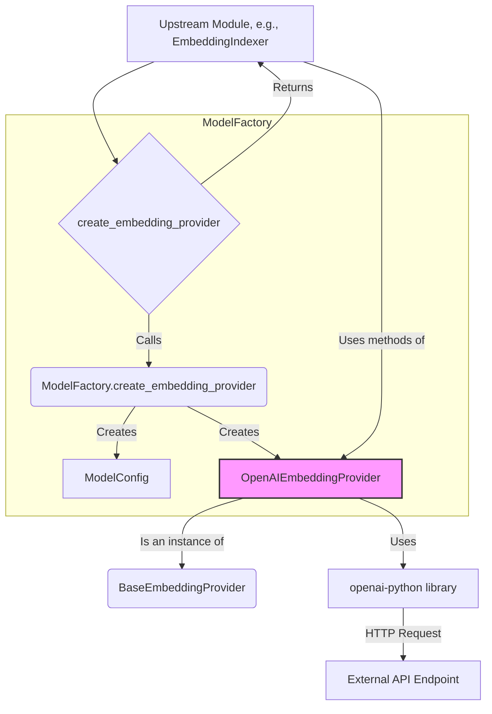

# Models 模块 (`coderepoindex.models`)

## 1. 概述

`models` 模块是 `CodeRepoIndex` 项目与外部AI模型服务交互的桥梁。它定义了一套统一的接口，用于调用不同提供商（如 OpenAI、阿里云通义千问等）的大语言模型（LLM）和文本嵌入（Embedding）服务。

该模块的核心设计思想是**将模型提供商的实现细节与上层业务逻辑（如 `core` 和 `embeddings` 模块）解耦**，使得更换或增加新的模型提供商变得简单。

## 2. 核心组件

### 2.1. 基础接口 (`base.py`)

此文件定义了所有模型提供商必须遵守的抽象基类（ABC）。

- **`ModelConfig` (Dataclass)**: 封装了调用一个模型所需的所有配置，如 `model_name`, `api_key`, `base_url`, `timeout` 等。
- **`BaseLLMProvider`**: 定义了与大语言模型（主要用于聊天补全）交互的接口，核心方法是 `chat_completion()` 和 `stream_chat_completion()`。
- **`BaseEmbeddingProvider`**: 定义了与文本嵌入模型交互的接口，核心方法是 `get_embedding()` 和 `get_embeddings_batch()`。

### 2.2. API 提供商实现 (`api_providers.py`)

该文件包含了基于API的具体模型提供商实现。目前主要实现了与 **OpenAI 兼容的 API** 的对接。这意味着它不仅可以调用 OpenAI 官方的模型，也可以调用任何提供了 OpenAI 兼容接口的服务，例如阿里云通义千问、本地部署的 vLLM/Ollama 等。

- **`OpenAILLMProvider`**: 实现了 `BaseLLMProvider` 接口，负责调用聊天补全API。
- **`OpenAIEmbeddingProvider`**: 实现了 `BaseEmbeddingProvider` 接口，负责调用文本嵌入API。
- **`OpenAIProvider`**: 这是一个统一的封装类，它内部同时持有一个 `OpenAILLMProvider` 和一个 `OpenAIEmbeddingProvider` 实例，方便上层模块统一管理。

### 2.3. 工厂模式 (`factory.py`)

为了简化模型提供商实例的创建过程，该模块使用了工厂模式。

- **`ModelFactory`**: 一个静态类，提供了 `create_llm_provider` 和 `create_embedding_provider` 等方法。
- **便捷函数**:
    - **`create_embedding_provider(...)`**: 这是上层模块（如 `embeddings`）最常使用的函数。它会根据传入的参数（或从环境变量加载）自动创建一个配置好的 `OpenAIEmbeddingProvider` 实例。
    - **`create_openai_providers(...)`**: 一个更具体的工厂函数，用于快速创建一个 `OpenAIProvider` 统一实例。

### 2.4. 工具函数 (`utils.py`)

提供了一系列在与API交互时非常有用的辅助函数。

- **`retry_with_exponential_backoff`**: 一个强大的装饰器，当API调用因为网络问题或速率限制（Rate Limit）而失败时，它会自动进行指数退避重试，大大增强了API调用的稳定性。
- **`truncate_text`**: 用于在文本超过模型输入限制时进行安全截断。
- **`validate_api_key`**: 检查 API Key 是否为空。

## 3. 工作流程



**典型使用**:
```python
import os
from dotenv import load_dotenv
from coderepoindex.models import create_embedding_provider

# 加载 .env 文件中的环境变量
load_dotenv()

# 1. 从环境变量中获取 API Key
#    (确保 .env 文件中有 DASHSCOPE_API_KEY 或 OPENAI_API_KEY)
api_key = os.getenv("DASHSCOPE_API_KEY")
base_url = "https://dashscope.aliyuncs.com/compatible-mode/v1" # 以通义千问为例

# 2. 使用工厂函数创建嵌入提供商
try:
    embedding_provider = create_embedding_provider(
        provider_type="api",
        model_name="text-embedding-v3",
        api_key=api_key,
        base_url=base_url
    )

    # 3. 使用提供商获取嵌入向量
    text_to_embed = "Hello, world!"
    vector = embedding_provider.get_embedding(text_to_embed)

    print(f"文本: '{text_to_embed}'")
    print(f"获取到的向量 (前5维): {vector[:5]}...")
    print(f"向量维度: {len(vector)}")

except ValueError as e:
    print(f"错误: {e}")
except Exception as e:
    print(f"API 调用失败: {e}")
```
