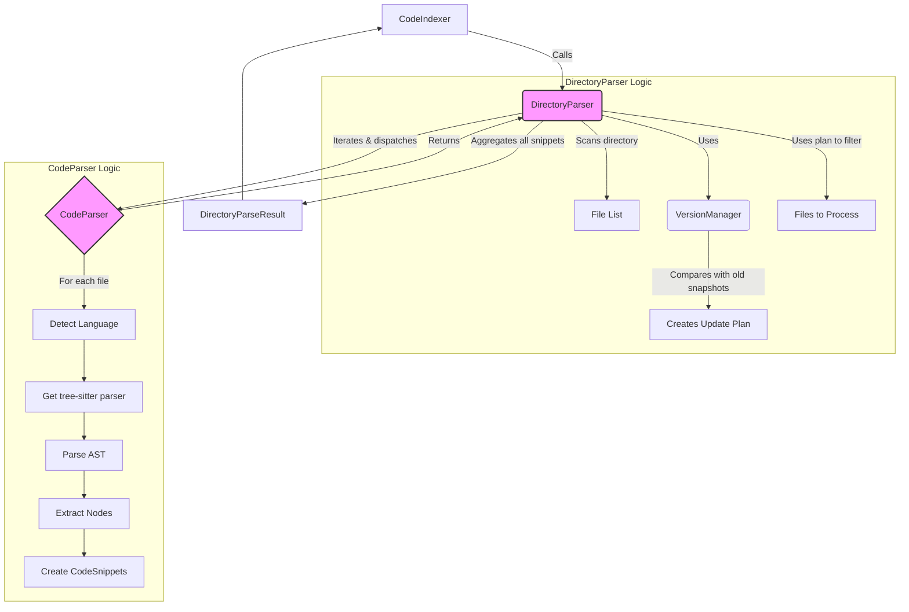

# Parsers 模块 (`coderepoindex.parsers`)

## 1. 概述

`parsers` 模块是 `CodeRepoIndex` 项目的“理解”核心。它负责将原始的源代码文件转换为结构化的、易于处理的数据。该模块的核心功能是遍历代码仓库目录，并使用 `tree-sitter` 库将每个支持的源文件解析成一个抽象语法树（AST），然后从AST中提取出有意义的逻辑单元，如函数、类、方法等。

## 2. 核心组件

### 2.1. `CodeParser` (`code_parser.py`)

这是模块的原子级解析器，负责处理**单个文件**。

- **核心技术**: 内部封装了 `tree-sitter` 和 `tree-sitter-languages` 库。`tree-sitter` 是一个高效的增量式解析库，能够为多种编程语言生成具体的语法树。
- **职责**:
    1.  **语言检测**: 根据文件扩展名判断编程语言。
    2.  **文件读取**: 安全地读取文件内容，并使用 `chardet` 库处理不同的字符编码。
    3.  **AST 解析**: 调用 `tree-sitter` 生成源代码的抽象语法树。
    4.  **节点提取**: 遍历AST，根据不同语言的语法规则（在 `config.py` 中定义），提取出函数、类、方法等节点的文本内容、起始/结束行号、名称、参数等信息。
    5.  **数据封装**: 将提取出的每个逻辑单元封装成一个 `CodeSnippet` 对象。
- **`CodeSnippet` (Dataclass)**: 这是解析结果的基本数据单元，包含了代码片段的类型、路径、名称、代码内容、注释、所属类名、行号等丰富信息。

### 2.2. `DirectoryParser` (`directory_parser.py`)

这是模块的目录级协调器，负责处理**整个代码仓库目录**。

- **职责**:
    1.  **文件遍历**: 递归地扫描指定目录，根据配置（`DirectoryConfig`）中的忽略规则（如 `.gitignore` 风格的模式）和文件类型过滤文件。
    2.  **任务分发**: 对每个需要处理的文件，调用 `CodeParser` 实例来执行解析。
    3.  **非代码文件处理**: 对无法被 `tree-sitter` 解析的纯文本文件（如 `.md`, `.txt`, `.json`），它会将其内容按一定规则（`chunk_size`, `chunk_overlap`）切分成文本块（`TEXT_CHUNK`）。
    4.  **结果聚合**: 将所有文件解析出的 `CodeSnippet` 列表聚合起来，形成一个完整的 `DirectoryParseResult`。
- **`DirectoryParseResult` (Dataclass)**: 封装了整个目录的解析结果，包括所有 `CodeSnippet`、处理统计（处理了多少文件、跳过了多少）、错误列表以及目录结构树。

### 2.3. 配置 (`config.py`)

该文件集中定义了所有与解析相关的配置。

- **`ParserConfig`**: 控制 `CodeParser` 的行为，如文件大小限制、是否提取注释/导入语句、关键词提取选项等。
- **`DirectoryConfig`**: 控制 `DirectoryParser` 的行为，如目录遍历深度、文件忽略模式、文本切块大小等。
- **`LANGUAGE_CONFIGS`**: 一个重要的字典，为每种支持的语言定义了其在 `tree-sitter` AST 中的节点类型名称（如 `function_definition` for Python），这是 `CodeParser` 能够准确提取信息的关键。

### 2.4. 版本与增量更新 (`version_manager.py`)

- **`VersionManager`**: 这是一个高级功能，旨在通过缓存文件快照（基于MD5哈希值）来实现对代码仓库的**增量索引**。
    - **工作原理**:
        1.  在首次索引时，为仓库中的每个文件计算一个MD5哈希值并保存。
        2.  在后续索引同一个仓库的新版本（新的 `commit_hash`）时，`DirectoryParser` 会先调用 `VersionManager`。
        3.  `VersionManager` 会对比新旧文件列表和每个文件的MD5哈希值，生成一个**更新计划**。
        4.  这个计划明确指出了哪些文件是新增的、哪些是修改过的、哪些是被删除的。
        5.  `DirectoryParser` 随后只对新增和修改过的文件调用 `CodeParser` 进行解析，大大减少了重复工作，显著提升了更新索引的速度。

## 3. 工作流程

