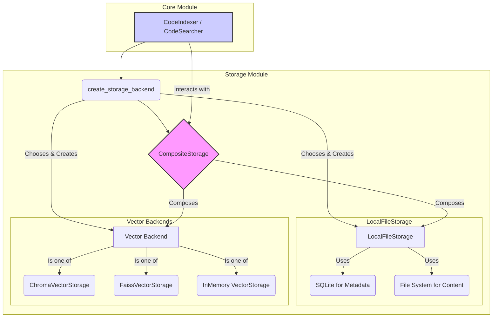

# Storage 模块 (`coderepoindex.storage`)

## 1. 概述

`storage` 模块是 `CodeRepoIndex` 项目的持久化层。它负责所有数据的存储和检索，包括代码块的元数据、代码内容、向量嵌入以及仓库索引信息。该模块被设计为可插拔的架构，允许开发者根据需求选择或实现不同的存储后端。

## 2. 核心设计

### 2.1. 抽象与接口 (`base.py`)

`base.py` 文件定义了存储层的核心抽象，确保了不同存储实现的一致性。

- **`StorageConfig`**: 一个数据类，用于统一配置所有存储后端，包括路径、缓存、备份等选项。
- **`BaseStorage`**: 所有存储类的最顶层抽象基类，定义了 `connect`, `disconnect`, `health_check` 等通用方法。
- **`BaseCodeBlockStorage`**: 定义了与 `CodeBlock` 对象相关的存储接口，如 `save_code_block`, `get_code_block`, `query_code_blocks` 等。
- **`BaseVectorStorage`**: 定义了与向量数据相关的存储接口，如 `add_vector`, `search_vectors`, `delete_vector` 等。
- **`BaseMetadataStorage`**: 定义了与元数据（如 `RepositoryIndex`）相关的存储接口，如 `save_repository_index`, `list_repository_indexes` 等。

### 2.2. 复合存储 (`composite_storage.py`)

- **`CompositeStorage` 类**: 这是 `storage` 模块对外的核心门面。它本身不直接实现存储逻辑，而是将一个具体的代码块/元数据存储实例和一个向量存储实例**组合**在一起，为上层模块（如 `core.CodeIndexer`）提供一个统一、简化的数据访问接口。
- **`create_storage_backend()` 工厂函数**: 这是创建 `CompositeStorage` 实例的推荐方式。它根据传入的参数（`storage_type`, `vector_backend`）自动选择并初始化对应的存储实现，然后将它们组合成一个 `CompositeStorage` 对象返回。

### 2.3. 本地文件存储 (`local_storage.py`)

这是默认的代码块和元数据存储实现，它完全基于本地文件系统，无需外部数据库依赖。

- **`LocalFileStorage` 类**:
    - **`LocalCodeBlockStorage`**:
        - **实现**: 采用混合存储策略。
            - **SQLite (`code_blocks.db`)**: 存储 `CodeBlock` 的所有结构化元数据（如ID, 文件路径, 行号, 语言, 名称等）。利用SQLite的索引能力，可以快速地进行元数据过滤和查询。
            - **文件系统 (`./content/`)**: 将每个 `CodeBlock` 的原始代码内容（`content`）单独保存为一个文本文件，以 `block_id.txt` 命名。这避免了将大块文本直接存入数据库，提高了性能。
    - **`LocalMetadataStorage`**:
        - **实现**: 使用简单的 JSON 文件来存储。
            - `repositories.json`: 存储 `RepositoryIndex` 对象列表。
            - `search_history.json`: 记录最近的搜索查询。
            - `general.json`: 用于存储其他通用键值对元数据。

### 2.4. 向量存储 (`vector_storage.py`)

该文件提供了多种向量存储的实现，允许用户根据性能、部署复杂度等因素进行选择。

- **`VectorStorage`**: 一个基于内存字典的简单实现，适用于快速原型开发和测试，但数据不会持久化。
- **`ChromaVectorStorage`**: 对接 [ChromaDB](https://www.trychroma.com/)。它是一个专门为AI应用设计的开源嵌入式数据库，提供持久化、元数据过滤和高效的向量搜索。这是**推荐的默认向量后端**。
- **`FaissVectorStorage`**: 对接 Facebook AI 的 [FAISS](https://faiss.ai/) 库。FAISS 提供了极致的向量搜索性能，但其本身不直接支持元数据过滤和动态增删，此处的实现通过额外的元数据文件进行了功能补足。

### 2.5. 缓存 (`cache.py`)

为了提升性能，模块内置了缓存机制。

- **`MemoryCache`**: 基于内存的LRU（最近最少使用）缓存。
- **`FileCache`**: 基于文件的缓存，可跨进程和会话持久化。

### 2.6. 工具 (`utils.py`)

提供了一系列与存储、路径、备份和清理相关的辅助函数，如 `create_backup`, `cleanup_old_backups`, `get_disk_usage` 等。

## 3. 工作流程

当上层模块（如 `CodeIndexer`）需要存储一个 `CodeBlock` 时：
1.  它调用 `CompositeStorage` 的 `save_code_block_with_vector()` 方法。
2.  `CompositeStorage` 内部将请求分发：
    - 调用 `LocalFileStorage` 的方法，将 `CodeBlock` 的元数据存入SQLite，内容存入文件系统。
    - 调用 `ChromaVectorStorage` (或其他向量后端) 的方法，将 `CodeBlock` 的ID、向量和部分关键元数据存入ChromaDB。
